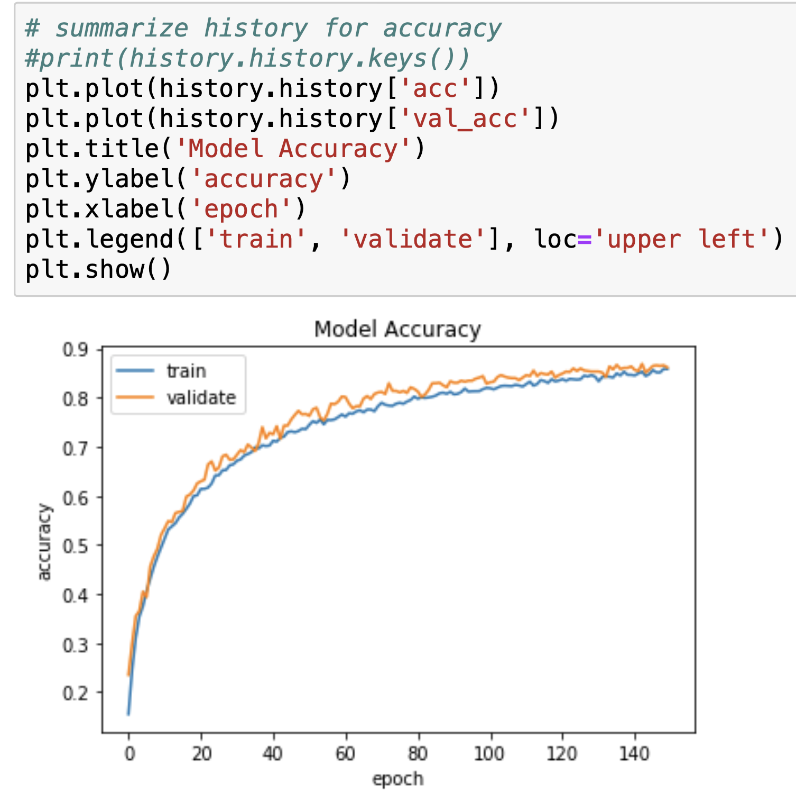

# Sound Classification

## Package Needed
Keras
TensorFlow
pickle
librosa
struct
sklearn
datetime
matplotlib
os

## Project Overview
The objective of the project is to build and train a model to identify sound. 

## File Structure
1. [Audio Classification.ipynb](./Audio&#32;Classification.ipynb) is the main file with all the functions and model definitions and most of the results.  
2. [sound_classification_model.json](./sound_classification_model.json) is the Model Object where the Neural Network is defined and store to .h5 file to avoid repeated model   compilation.  
3. [weights.best.basic_cnn.hdf5](./weights.best.basic_cnn.hdf5) is the file that contains the weight used in the model. So that we can quickly continue the progress to do a prediction.
4. [UrbanSound8K_README.txt](./UrbanSound8K_README.txt) is the README of the original dataset.  
5. [audio_features_mfcc40.pickle](./audio_features_mfcc40.pickle) is the preprocessed data file. Processing the data can take 15 minutes up, store the preprocessed data is important to save time.  

## How to Use
The entire notebook contains the functions to preprocess the specified dataset, define a Convolutional Neural Network Model and to train the model with the data. The model and the trained weights are save into specified files.  
At the end of the notebook, you have the part that you can load the model and the pretrained weights. And use the next cell to load user specified sound clip. The sound clip have to have about 2s, and the part containing information need to be within the 2s part. 

## Package Needed
Keras
TensorFlow
pickle
librosa
struct
sklearn
datetime
matplotlib
os

## Project Overview
The objective of the project is to build and train a model to identify sound. 

## File Structure
1. This is the [Main Notebook](./Audio&#32;Classification.ipynb) with all the functions and model definitions and most of the results.  
2. This is the [Model Object](./model.h5) where the Neural Network is defined and store to .h5 file to avoid repeated model   compilation.  
3. This is the [README](./UrbanSound8K_README.txt) of the original dataset.  
4. This is the [Preprocessed Data](./audio_features_mfcc40.pickle). Processing the data can take 15 minutes up, store the preprocessed data is important to save time.

## How to Use
At the end of the notebook, you have the part that you can load the model and the pretrained weights. And use the next cell to load user specified sound clip. The sound clip have to have about 2s, and the part containing information need to be within the 2s part. 

## Data Preprocessing
The data preprocessing in this case is to turn the 1D audio signal to 2D (actually 3D, but the last dimension is 1) audio sprectrum. This is done through Librosa library.  
One critical parameter-the vertical dimention in the audio sprectrum (the dimention n in the input sprectrum n*173*1) is experimented.  
  
As the image show, the vertical dimention of 40 is the best value. 

## Model Architecture
| Layer         		|     Description	        					| 
|:---------------------:|:---------------------------------------------:| 
| Input         		| 173x40x1 Audio Spectrum   							| 
| Convolution 2x2     	| 1x1 stride, valid padding, filter size 16 	|
| RELU					|												|
| Max pooling	      	| 2x2 stride, valid padding 	|
| Dropout		 		|Droop rate 0.4									|
| Convolution 2x2     	| 1x1 stride, valid padding, filter size 32 	|
| RELU					|												|
| Max pooling	      	| 2x2 stride, valid padding 	|
| Dropout		 		|Droop rate 0.4									|
| Convolution 2x2     	| 1x1 stride, valid padding, filter size 64 	|
| RELU					|												|
| Max pooling	      	| 2x2 stride, valid padding  	|
| Dropout		 		|Droop rate 0.4									|
| Convolution 2x2     	| 1x1 stride, valid padding, filter size 128 	|
| RELU					|												|
| Max pooling	      	| 2x2 stride, valid padding 	|
| Dropout		 		|Droop rate 0.4									|
| Flatten				| faltten to 1 dimension			|
| Softmax				|Output layer using Softmax				|
  
Over all the model has 4 Convolutional blocks. Each block is consisted of a convolution layer folowed by a ReLu activation layer. And then a Max pooling layer and a Dropout to regularize the ouput. Finally, there is a fully connected flatten layer with a softmax activation. The model is a bit like the classic LeNet-5 model.

## Results

The achieved training accuracy is 90% and the validation accuracy is 90%.

## Unsuccessful Attempts
MobileNet model is attempted to be applied, but not successful. The dimensions of the dataset seems to be inconsistent with the predifined model. The MobileNet model works best with square images (in this case audio sprectrum), but the data we have is 173*40*1 which is very streched. This could be the reason while MobileNet and most of other CNN models cannot be applied on the dataset. However, even the bug is fixed, it is likely that CNN models won't work well on audio data.

## Future Developments
As to the future development, one can either fix the issue with MobileNet (and other CNN networks) and have the model trained on the preprocessed data or use an Recurrent Neural Network (RNN) model. It is much more effective to RNN models on sequential data like audio or speech. Since RNN model can capture the sequential relation in the data, while CNN model does this poorly.

## Liscense
Private use only
